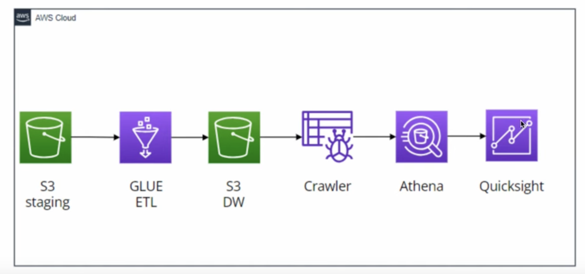
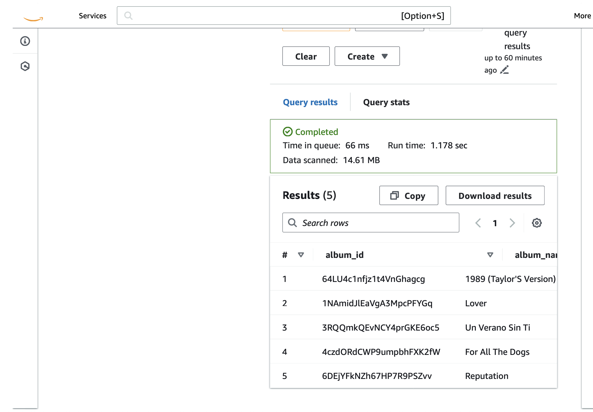

# Spotify Data Engineering and Analysis Using AWS

This project demonstrates a complete data engineering lifecycle using AWS to process and analyze Spotify's 2023 dataset. From initial data preparation in Python to interactive visual analytics in AWS QuickSight, this project utilizes a variety of AWS services to uncover insights into Spotify's vast music dataset.

## Overview

The journey begins with cleaning and preprocessing the Spotify dataset using Python, followed by loading the refined data into Amazon S3. AWS Glue's ETL jobs are utilized for data transformation, enriching the dataset for analytical purposes. AWS Glue crawlers then automate the schema detection, facilitating SQL-based explorations via Amazon Athena. The project culminates with the construction of analytical dashboards in AWS QuickSight, providing a comprehensive view of music trends and patterns.

## Project Workflow

- **Data Preparation**: Initial data cleaning and preprocessing with Python.
- **Data Staging and Warehousing**: Leveraging S3 for data storage, followed by transformation and loading into a data warehouse.
- **ETL Processing**: Employing AWS Glue for robust ETL workflows.
- **Data Analysis**: Utilizing Amazon Athena for detailed SQL-based data analysis.
- **Visualization and Reporting**: Creating dynamic dashboards in AWS QuickSight for data visualization.

## Services Used

- **Amazon S3**: For data storage and management.
- **AWS Glue**: For data cataloging and ETL processing.
- **Amazon Athena**: For querying and analyzing data.
- **AWS QuickSight**: For data visualization and business intelligence.
- **Python**: For initial data cleaning and preprocessing.

## Dataset Overview

The dataset includes a comprehensive collection of Spotify tracks, including metadata such as track popularity, artist details, and album information, aiming to explore musical preferences and streaming trends.

Dataset Link - https://www.kaggle.com/datasets/tonygordonjr/spotify-dataset-2023

## Architecture Diagram

## Detailed Insights Through Screenshots

### AWS Glue and ETL

- **AWS Glue Crawlers**: 
- **ETL Jobs in AWS Glue**: 

### S3 Buckets and Data Staging

- **S3 Buckets for Data Staging and Warehousing**: 
- **Staging Data in S3**: 

### Athena Queries

#### SQL Queries Analysis

- **Total Tracks Analysis**: 
- **Most Popular Tracks Analysis**: 
  - 
  - 
- **Albums with Highest Popularity**: 
  - 
  - 
- **Genre Popularity Analysis**: 
  - 
  - 
- **Track Popularity Over Time**: 
  - 
  - 

### Other Significant Screenshots

- **Data Warehouse Data**: 
- **Visual ETL Job and Pipeline**: 
- **Table in Athena Query Editor**: 

## Additional Resources

- Detailed project documentation and data models are available upon request.

## Conclusion

This project encapsulates the essence of modern data engineering, illustrating the potential of AWS cloud services combined with Python's processing power to analyze and visualize Spotify's expansive dataset. The insights derived not only reveal current music trends but also pave the way for predictive analytics in the music industry.
